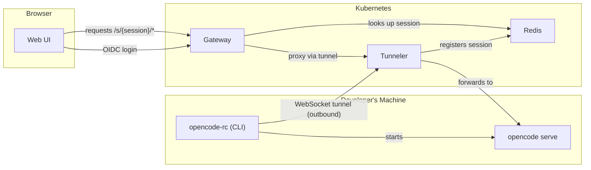

# OpenCode RC

Remote control for [OpenCode](https://github.com/anomalyco/opencode) in corporate environments.

OpenCode RC lets developers run OpenCode on their machines while accessing it from a browser through a centralized gateway with OIDC authentication. A reverse WebSocket tunnel means dev machines don't need inbound network access — they connect outward to the gateway.

## Architecture



1. Developer runs `opencode-rc` CLI — it authenticates via OIDC, starts `opencode serve`, and opens a WebSocket tunnel to the tunneler
2. The tunneler registers the session in Redis and multiplexes browser traffic through the tunnel
3. The gateway authenticates browser users via OIDC, looks up sessions in Redis, and proxies requests through the tunneler
4. The web UI provides a session picker and wraps the OpenCode web interface

## Components

| Component | Path | Description |
|-----------|------|-------------|
| Gateway | `backend/` (Go) | OIDC auth, session lookup, reverse proxy to tunneler, serves web UI |
| Tunneler | `backend/` (Go) | WebSocket tunnel server, session registration, request multiplexing |
| CLI | `cli/` (Node) | OIDC login via PKCE, starts opencode serve, maintains tunnel to tunneler |
| Web UI | `web/` (SolidJS) | Session picker, user bar, wraps OpenCode's web interface |

Gateway and tunneler are the same Go binary (`opencode-rc gateway` / `opencode-rc tunneler`).

## Deploy with Helm

### Prerequisites

- Kubernetes cluster
- An OIDC provider (Keycloak, Dex, Azure AD, etc.)
- Two OIDC clients configured:
  - **Web client** (confidential): for browser login via the gateway. Redirect URI: `https://<gateway-host>/auth/callback`
  - **CLI client** (public): for developer CLI login via PKCE. Redirect URI: `http://127.0.0.1:0/callback`

### Install

```bash
helm install opencode-rc ./charts/opencode-rc \
  --set profile=production \
  --set oidc.issuer=https://sso.corp.example.com \
  --set oidc.clientId=opencode-rc \
  --set oidc.cliClientId=opencode-rc-cli \
  --set oidc.redirectUri=https://opencode-rc.corp.example.com/auth/callback \
  --set existingSecret=opencode-rc-secrets
```

The `existingSecret` must contain:

| Key | Description |
|-----|-------------|
| `cookie-secret` | 64-char hex string (32 bytes) for session cookie encryption |
| `oidc-client-secret` | OIDC client secret for the web client |
| `redis-url` | Redis connection URL (only if `redis.enabled=false`) |

### Key Values

| Value | Default | Description |
|-------|---------|-------------|
| `profile` | `local` | `local` deploys oidc-mock + Redis; `production` requires `existingSecret` and `oidc.issuer` |
| `oidc.issuer` | `""` | OIDC provider URL (required for production) |
| `oidc.clientId` | `opencode-rc` | Web client ID (confidential) |
| `oidc.cliClientId` | `opencode-rc-cli` | CLI client ID (public, PKCE) |
| `oidc.redirectUri` | auto-derived | OAuth callback URL |
| `oidc.cookieDomain` | `""` | Cookie domain scope |
| `redis.enabled` | `true` | Deploy Redis; set `false` to use external Redis via secret |
| `tlsInsecureSkipVerify` | `false` | Skip TLS certificate verification for OIDC discovery |
| `gateway.ingress.enabled` | `false` | Create Ingress for gateway |
| `tunneler.ingress.enabled` | `false` | Create Ingress for tunneler |
| `global.imageRegistry` | `""` | Override image registry for all components (e.g. `registry.corp.example.com`) |

See [`charts/opencode-rc/values.yaml`](charts/opencode-rc/values.yaml) for all options.

### Local Profile

The `local` profile deploys an OIDC mock server with test users (alice/bob) and a built-in Redis — no external dependencies needed:

```bash
helm install opencode-rc ./charts/opencode-rc
```

If the OIDC mock needs to be reachable from outside the cluster (e.g. via Ingress), set `oidcMock.issuer` to the external URL:

```bash
helm install opencode-rc ./charts/opencode-rc \
  --set oidcMock.issuer=https://oidc-mock.corp.example.com
```

### Air-Gapped Environments

Override the image registry to pull from an internal registry:

```bash
helm install opencode-rc ./charts/opencode-rc \
  --set global.imageRegistry=registry.corp.example.com/opencode-rc
```

Images to mirror:

| Image | Tag |
|-------|-----|
| `ghcr.io/rophy/opencode-rc/backend` | `0.1.1` |
| `ghcr.io/rophy/oidc-mock` | `20260913-34fdbaf` |
| `redis` | `7.4.11-alpine` |

## CLI Usage

Install:

```bash
npm install -g opencode-rc
```

Configure `~/.config/opencode/rc.json`:

```json
{
  "gatewayUrl": "https://opencode-rc.corp.example.com",
  "oidc": {
    "issuer": "https://sso.corp.example.com",
    "clientId": "opencode-rc-cli"
  }
}
```

Run:

```bash
opencode-rc
```

The CLI authenticates via OIDC (opens browser), starts `opencode serve`, and maintains a tunnel to the gateway. Press `Ctrl+C` to disconnect.

Environment variables override the config file — see the [CLI README](cli/README.md) for details.

### CLI Environment Variables

| Variable | Description |
|----------|-------------|
| `OPENCODE_RC_GATEWAY_URL` | Gateway URL |
| `OIDC_ISSUER` | OIDC provider URL |
| `OIDC_CLIENT_ID` | CLI client ID |
| `TLS_INSECURE_SKIP_VERIFY` | Set to `true` to skip TLS certificate verification |

## License

See [OpenCode](https://github.com/anomalyco/opencode) for upstream license terms.
