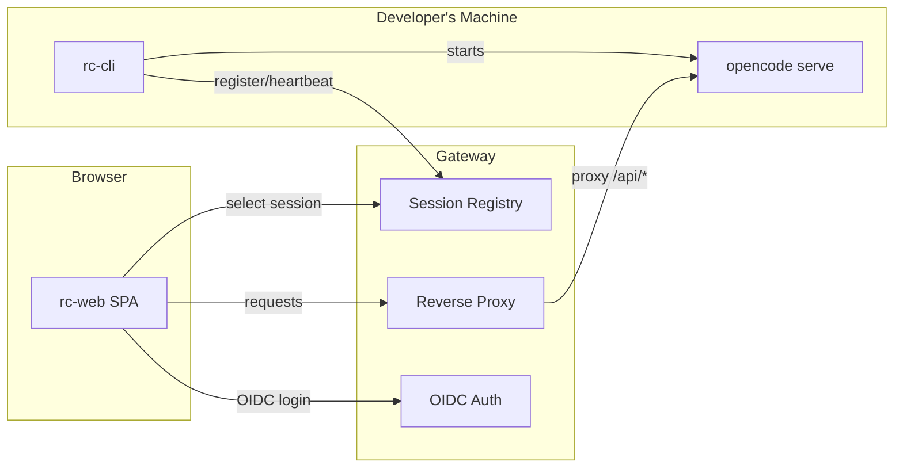

# OpenCode RC

Remote control gateway for [OpenCode](https://github.com/anomalyco/opencode).

OpenCode RC sits between developers and their OpenCode instances, adding OIDC authentication, multi-user session management, and a web UI for selecting and connecting to sessions.

## How It Works



1. **rc-cli** starts `opencode serve` on a developer's machine and registers it with the gateway
2. **Gateway** authenticates users via OIDC and maintains a registry of active sessions
3. **rc-web** provides a session picker and wraps the OpenCode web UI with user info and logout
4. Browser traffic is proxied through the gateway to the correct developer machine

## Components

| Component | Language | Description |
|-----------|----------|-------------|
| `backend/` | Go | Reverse proxy with OIDC auth, session registry, WebSocket support |
| `cli/` | Node | Starts opencode serve, authenticates with gateway, heartbeat registration |
| `web/` | TypeScript/SolidJS | SPA wrapping OpenCode's web UI with session picker and user bar |

## Quick Start

```bash
# Clone
git clone --recurse-submodules <repo-url>
cd opencode-rc

# Build web UI
cd vendor/opencode && bun install && cd ..
cd web && bun install && bun run build && cd ..
```

## Running Locally with Docker Compose

The root `docker-compose.yml` provides all components:

- **gateway** — the OpenCode RC gateway
- **oidc-mock** — a mock OIDC provider with test users
- **dev-machine** — a simulated OpenCode instance backed by an AI mock, auto-registers with the gateway

No ports are exposed to the host. All services communicate over the Docker network. E2e tests and manual tasks run inside the `dev-machine` container.

### Start the environment

```bash
docker compose --profile rc up -d --build
```

### Run e2e tests

With the stack running:

```bash
docker compose exec -T dev-machine sh -c "cd /e2e && npx vitest run"
```

### Test users

The OIDC mock provides two test users:

| Username | Email |
|----------|-------|
| user1 | alice@example.com |
| user2 | bob@example.com |

No password is required — select a user at the mock login page.

## Configuration

The gateway is configured via environment variables:

| Variable | Description |
|----------|-------------|
| `PORT` | Listen port (default: 8080) |
| `OIDC_ISSUER` | OIDC provider URL |
| `OIDC_CLIENT_ID` | OIDC client ID |
| `OIDC_CLIENT_SECRET` | OIDC client secret |
| `OIDC_REDIRECT_URI` | OAuth callback URL |
| `COOKIE_SECRET` | 64-char hex string for session cookies |
| `COOKIE_SECURE` | Set to `true` for HTTPS |
| `WEBUI_DIR` | Path to rc-web dist directory (optional — falls back to built-in dashboard) |

## Requirements

- Go 1.22+
- Node.js / Bun
- Docker (for e2e environment)

## License

See [OpenCode](https://github.com/anomalyco/opencode) for upstream license terms.
