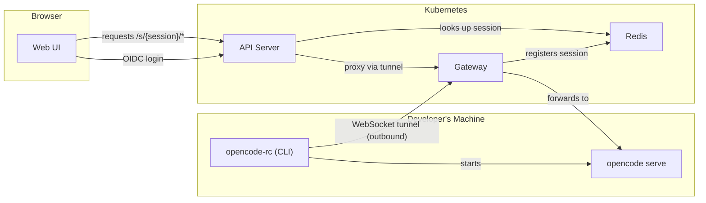

# OpenCode RC

Remote control for [OpenCode](https://github.com/anomalyco/opencode) in corporate environments.

OpenCode RC lets developers run OpenCode on their machines while accessing it from a browser through a centralized API server with OIDC authentication. A reverse WebSocket tunnel means dev machines don't need inbound network access — they connect outward to the gateway.

## Architecture



1. Developer runs `opencode-rc` CLI — it authenticates via OIDC, starts `opencode serve`, and opens a WebSocket tunnel to the gateway
2. The gateway registers the session in Redis and multiplexes browser traffic through the tunnel
3. The API server authenticates browser users via OIDC, looks up sessions in Redis, and proxies requests through the gateway
4. The web UI provides a session picker and wraps the OpenCode web interface

## Components

| Component | Path | Description |
|-----------|------|-------------|
| API Server | `api/` (TypeScript) | OIDC auth, session lookup, reverse proxy to gateway (serves no UI) |
| Gateway | `gateway/` (Go) | WebSocket tunnel server, session registration, request multiplexing |
| CLI | `cli/` (Node) | OIDC login via PKCE, starts opencode serve, maintains tunnel to gateway |
| Web UI | `ui/` (SolidJS) | Session picker, user bar, wraps OpenCode's web interface |
| UI Image | `ui/web/` (nginx) | Serves the built SPA on its own host, configured with the API URL at container start |

## Deploy with Helm

### Prerequisites

- Kubernetes cluster
- An OIDC provider (Keycloak, Dex, Azure AD, etc.)
- Two OIDC clients configured:
  - **API client** (confidential): for browser login via the API server. Redirect URI: `https://<api-host>/auth/callback`
  - **CLI client** (public): for developer CLI login via PKCE. Redirect URI: `http://127.0.0.1:0/callback`

### Install

```bash
helm install opencode-rc ./charts/opencode-rc \
  --set profile=production \
  --set oidc.issuer=https://sso.corp.example.com \
  --set oidc.clientId=opencode-rc \
  --set oidc.cliClientId=opencode-rc-cli \
  --set existingSecret=opencode-rc-secrets \
  --set expose.type=ingress \
  --set expose.host=example.com \
  --set expose.ingress.className=nginx \
  --set expose.ingress.tlsSecretName=wildcard-example-com-tls
```

`expose.*` exposes the API, the gateway and the UI on hosts derived from the Helm release name and `expose.host`:

| Host | Routes |
|------|--------|
| `{release}.{host}` (e.g. `opencode-rc.example.com`) | `/tunnel` → gateway (CLI tunnel), everything else → API |
| `{release}-ui.{host}` (e.g. `opencode-rc-ui.example.com`) | web UI (when `ui.enabled`) |
| `{release}-oidc.{host}` (e.g. `opencode-rc-oidc.example.com`) | bundled oidc-mock (`profile=local` only) |

The UI and the API are served from two different hosts. The browser loads the UI from the UI host and calls the API host directly. Public URLs are `{expose.scheme}://<host>` (`https` by default — TLS usually terminates at the ingress controller, load balancer or Istio gateway); set `api.publicUrl` / `ui.publicUrl` to override them. The OIDC redirect URI defaults to `<api public URL>/auth/callback`, e.g. `https://opencode-rc.example.com/auth/callback`. The CLI gateway URL is the API host, e.g. `https://opencode-rc.example.com`. Only `/tunnel` of the gateway is exposed; its `/healthz` is not reachable from outside the cluster.

The Ingress sets `nginx.ingress.kubernetes.io/proxy-read-timeout` and `proxy-send-timeout` to `"3600"` by default so ingress-nginx does not cut idle CLI tunnels, SSE streams and terminal WebSockets; values in `expose.ingress.annotations` override them. With other ingress controllers, configure the equivalent long timeouts through `expose.ingress.annotations`.

With Istio, point `expose.virtualService.gateways` at existing Istio Gateways that accept the hosts above (e.g. a `*.example.com` server). The chart creates VirtualServices (`networking.istio.io/v1` by default, which needs Istio 1.22+; set `expose.virtualService.apiVersion: networking.istio.io/v1beta1` for older Istio) and routes `/tunnel` to the gateway; Istio route timeouts are disabled by default, so long-lived tunnels and streams need no override:

```bash
helm install opencode-rc ./charts/opencode-rc \
  --set profile=production \
  --set oidc.issuer=https://sso.corp.example.com \
  --set existingSecret=opencode-rc-secrets \
  --set expose.type=virtualService \
  --set expose.host=example.com \
  --set 'expose.virtualService.gateways={istio-system/public-gateway}'
```

The `existingSecret` must contain:

| Key | Description |
|-----|-------------|
| `cookie-secret` | 64-char hex string (32 bytes), HMAC key for access tokens |
| `oidc-client-secret` | OIDC client secret for the web client |
| `redis-url` | Redis connection URL (only if `redis.enabled=false`) |

### Key Values

| Value | Default | Description |
|-------|---------|-------------|
| `profile` | `local` | `local` deploys oidc-mock + Redis; `production` requires `existingSecret` and `oidc.issuer` |
| `oidc.issuer` | `""` | OIDC provider URL (required for production) |
| `oidc.clientId` | `opencode-rc` | Web client ID (confidential) |
| `oidc.cliClientId` | `opencode-rc-cli` | CLI client ID (public, PKCE) |
| `oidc.redirectUri` | auto-derived | OAuth callback URL; defaults to `<api public URL>/auth/callback` |
| `auth.accessTokenTTL` | `15m` | Access token lifetime |
| `auth.sessionTTL` | `7d` | Absolute login lifetime; refresh never extends it |
| `auth.allowedOrigins` | `[]` | Extra browser origins allowed for return_to and CORS |
| `auth.appLoginPrompt` | `select_account` | OIDC `prompt` sent to the IdP for mobile app logins (`select_account`, `login`, `consent`, or `""`); check that your IdP honors it |
| `redis.enabled` | `true` | Deploy Redis; set `false` to use external Redis via secret |
| `tlsInsecureSkipVerify` | `false` | Skip TLS certificate verification for OIDC discovery |
| `expose.type` | `none` | `none`, `ingress` (one Ingress) or `virtualService` (Istio VirtualServices) |
| `expose.host` | `""` | Base domain; hosts are `{release}.{host}`, `{release}-ui.{host}` and, for `profile=local`, `{release}-oidc.{host}`. Required unless `expose.type=none` |
| `expose.scheme` | `https` | Scheme browsers and the CLI use to reach the hosts |
| `expose.ingress.className` | `""` | `ingressClassName` of the Ingress |
| `expose.ingress.annotations` | `{}` | Ingress annotations, merged over the default ingress-nginx `proxy-read-timeout`/`proxy-send-timeout` of `"3600"` |
| `expose.ingress.tlsSecretName` | `""` | TLS secret covering all hosts (e.g. a wildcard certificate); no `tls` section when empty |
| `expose.virtualService.gateways` | `[]` | Existing Istio Gateways (`namespace/name`); required for `virtualService` |
| `expose.virtualService.apiVersion` | `networking.istio.io/v1` | VirtualService API version; `networking.istio.io/v1beta1` for Istio older than 1.22 |
| `expose.virtualService.annotations` | `{}` | VirtualService annotations |
| `api.publicUrl` | `""` | Browser-facing API URL; overrides the URL derived from `expose.*`. Required when `ui.publicUrl` is set with `expose.type=none` |
| `ui.enabled` | `true` | Deploy the UI image (nginx serving the built SPA) |
| `ui.publicUrl` | `""` | Browser-facing UI URL; overrides the URL derived from `expose.*`. Added to the API's allowed origins |
| `global.imageRegistry` | `""` | Override image registry for all components (e.g. `registry.corp.example.com`) |

See [`charts/opencode-rc/values.yaml`](charts/opencode-rc/values.yaml) for all options.

### Local Profile

The `local` profile deploys an OIDC mock server with test users (alice/bob) and a built-in Redis — no external dependencies needed:

```bash
helm install opencode-rc ./charts/opencode-rc
```

With `expose.type` set (and no `oidc.issuer`), the OIDC mock is exposed on `{release}-oidc.{host}` and uses `{expose.scheme}://{release}-oidc.{host}` as its issuer. The API and the gateway still fetch discovery, tokens and keys from the in-cluster service, and only send browsers to the external host.

If the OIDC mock is reachable from outside the cluster some other way, set `oidcMock.issuer` to its external URL:

```bash
helm install opencode-rc ./charts/opencode-rc \
  --set oidcMock.issuer=https://oidc-mock.corp.example.com
```

### Air-Gapped Environments

Override the image registry to pull from an internal registry:

```bash
helm install opencode-rc ./charts/opencode-rc \
  --set global.imageRegistry=registry.corp.example.com/opencode-rc
```

Images to mirror:

| Image | Tag |
|-------|-----|
| `ghcr.io/rophy/opencode-rc/api` | `0.6.0` |
| `ghcr.io/rophy/opencode-rc/ui` | `0.5.0` |
| `ghcr.io/rophy/opencode-rc/gateway` | `0.6.0` |
| `ghcr.io/rophy/oidc-mock` | `20260913-34fdbaf` |
| `redis` | `7.4.11-alpine` |

### Upgrading to 0.6

0.6 splits the web UI out of the API server into its own image and host:

- Chart values `web.*` were renamed to `api.*`. The chart fails (`chart values web.* were renamed to api.*`) if any `web.*` value is still set, instead of silently ignoring it.
- Per-component ingress values (`api.ingress`, `ui.ingress`, `gateway.ingress`, and `web.ingress` before the rename) were replaced by `expose.*`, which exposes all of them together. The chart fails (`per-component ingress settings ... were replaced by expose.*`) if any of them is still set; remove them from your values or with `--set gateway.ingress=null` (and likewise for the others).
- **Hostnames change.** Hosts are now derived from the release name: the API and the CLI gateway share `{release}.{host}` (`/tunnel` goes to the gateway), and the UI gets `{release}-ui.{host}`. For release `opencode-rc` and `expose.host=example.com` that is `https://opencode-rc.example.com` (API, OIDC redirect URI `https://opencode-rc.example.com/auth/callback`, CLI `gatewayUrl`) and `https://opencode-rc-ui.example.com` (UI). Update DNS/certificates, the redirect URI registered at your OIDC provider, and the CLI `gatewayUrl`.
- The gateway's `/healthz` is no longer exposed outside the cluster; only `/tunnel` is (the CLI only uses `/tunnel`).
- The `nginx.ingress.kubernetes.io/proxy-{read,send}-timeout: "3600"` defaults of the old gateway Ingress now apply to the single Ingress (all hosts); override them in `expose.ingress.annotations`.
- The API host no longer serves the UI. Old bookmarks pointing at the API host (e.g. `/`, `/s/<session>/`) now return `404`; point users at the UI host instead.
- Air-gapped mirrors: mirror the new `ghcr.io/rophy/opencode-rc/api` and `ghcr.io/rophy/opencode-rc/ui` images instead of `ghcr.io/rophy/opencode-rc/web` (see the table above).
- Everyone is logged out once: bearer tokens issued before the upgrade are invalidated.

The simplest upgrade is a full values file: export the current values, rename the top-level `web:` key to `api:`, replace the `ingress:` blocks with `expose:`, and upgrade without reusing values:

```bash
helm get values opencode-rc -o yaml > values.yaml
# edit values.yaml: rename `web:` to `api:`, delete every `ingress:` block
# (web/api, ui, gateway), then add
#   expose:
#     type: ingress
#     host: example.com
#     ingress:
#       className: nginx
#       tlsSecretName: wildcard-example-com-tls
helm upgrade opencode-rc ./charts/opencode-rc -f values.yaml
```

Alternatively, with Helm 3.14+ use `--reset-then-reuse-values` and move each `web.*` value you had set to `api.*` explicitly, removing the old keys with `--set web=null` and `--set gateway.ingress=null` (plain `--reuse-values` does not pick up the new chart defaults and must not be used):

```bash
helm upgrade opencode-rc ./charts/opencode-rc --reset-then-reuse-values \
  --set web=null \
  --set gateway.ingress=null \
  --set expose.type=ingress \
  --set expose.host=example.com
```

## CLI Usage

Install:

```bash
npm install -g opencode-rc
```

Configure `~/.config/opencode/rc.json`:

```json
{
  "gatewayUrl": "https://opencode-rc.example.com",
  "oidc": {
    "issuer": "https://sso.corp.example.com",
    "clientId": "opencode-rc-cli"
  }
}
```

Run:

```bash
opencode-rc
```

The CLI authenticates via OIDC (opens browser), starts `opencode serve`, and maintains a tunnel to the gateway. Press `Ctrl+C` to disconnect.

Environment variables override the config file — see the [CLI README](cli/README.md) for details.

### CLI Environment Variables

| Variable | Description |
|----------|-------------|
| `OPENCODE_RC_GATEWAY_URL` | Gateway URL |
| `OIDC_ISSUER` | OIDC provider URL |
| `OIDC_CLIENT_ID` | CLI client ID |
| `TLS_INSECURE_SKIP_VERIFY` | Set to `true` to skip TLS certificate verification |
