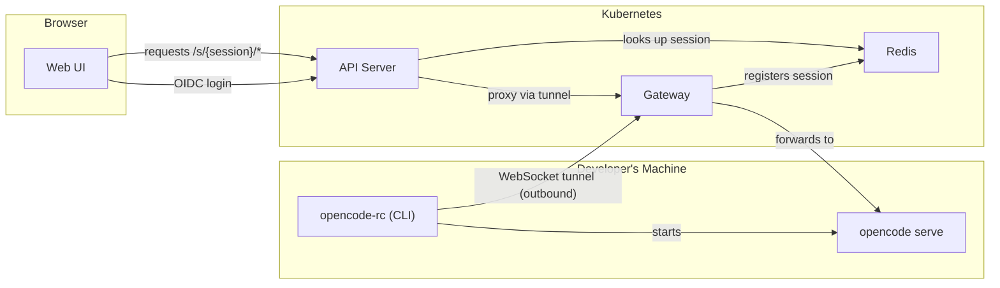

# OpenCode RC

Remote control for [OpenCode](https://github.com/anomalyco/opencode) in corporate environments.

OpenCode RC lets developers run OpenCode on their machines while accessing it from a browser through a centralized API server with OIDC authentication. A reverse WebSocket tunnel means dev machines don't need inbound network access — they connect outward to the gateway.

## Architecture



1. Developer runs `opencode-rc` CLI — it authenticates via OIDC, starts `opencode serve`, and opens a WebSocket tunnel to the gateway
2. The gateway registers the session in Redis and multiplexes browser traffic through the tunnel
3. The API server authenticates browser users via OIDC, looks up sessions in Redis, and proxies requests through the gateway
4. The web UI provides a session picker and wraps the OpenCode web interface

## Components

| Component | Path | Description |
|-----------|------|-------------|
| API Server | `api/` (TypeScript) | OIDC auth, session lookup, reverse proxy to gateway (serves no UI) |
| Gateway | `gateway/` (Go) | WebSocket tunnel server, session registration, request multiplexing |
| CLI | `cli/` (Node) | OIDC login via PKCE, starts opencode serve, maintains tunnel to gateway |
| Web UI | `ui/` (SolidJS) | Session picker, user bar, wraps OpenCode's web interface |
| UI Image | `ui/web/` (nginx) | Serves the built SPA on its own host, configured with the API URL at container start |

## Deploy with Helm

### Prerequisites

- Kubernetes cluster
- An OIDC provider (Keycloak, Dex, Azure AD, etc.)
- Two OIDC clients configured:
  - **API client** (confidential): for browser login via the API server. Redirect URI: `https://<api-host>/auth/callback`
  - **CLI client** (public): for developer CLI login via PKCE. Redirect URI: `http://127.0.0.1:0/callback`

### Install

```bash
helm install opencode-rc ./charts/opencode-rc \
  --set profile=production \
  --set oidc.issuer=https://sso.corp.example.com \
  --set oidc.clientId=opencode-rc \
  --set oidc.cliClientId=opencode-rc-cli \
  --set existingSecret=opencode-rc-secrets \
  --set api.ingress.enabled=true \
  --set api.ingress.host=opencode-rc-api.corp.example.com \
  --set api.publicUrl=https://opencode-rc-api.corp.example.com \
  --set ui.ingress.enabled=true \
  --set ui.ingress.host=opencode-rc.corp.example.com \
  --set ui.publicUrl=https://opencode-rc.corp.example.com
```

The UI and the API are served from two different hosts. The browser loads the UI from the UI host and calls the API host directly, so both must be reachable from users' browsers. Public URLs are derived from each ingress (`https://<host>` when the ingress has `tls`, else `http://<host>`); set `api.publicUrl` / `ui.publicUrl` when that derivation is wrong — for example when TLS is terminated at a load balancer in front of an ingress without `tls`. The OIDC redirect URI defaults to `<api public URL>/auth/callback`.

The `existingSecret` must contain:

| Key | Description |
|-----|-------------|
| `cookie-secret` | 64-char hex string (32 bytes), HMAC key for access tokens |
| `oidc-client-secret` | OIDC client secret for the web client |
| `redis-url` | Redis connection URL (only if `redis.enabled=false`) |

### Key Values

| Value | Default | Description |
|-------|---------|-------------|
| `profile` | `local` | `local` deploys oidc-mock + Redis; `production` requires `existingSecret` and `oidc.issuer` |
| `oidc.issuer` | `""` | OIDC provider URL (required for production) |
| `oidc.clientId` | `opencode-rc` | Web client ID (confidential) |
| `oidc.cliClientId` | `opencode-rc-cli` | CLI client ID (public, PKCE) |
| `oidc.redirectUri` | auto-derived | OAuth callback URL; defaults to `<api public URL>/auth/callback` |
| `auth.accessTokenTTL` | `15m` | Access token lifetime |
| `auth.sessionTTL` | `7d` | Absolute login lifetime; refresh never extends it |
| `auth.allowedOrigins` | `[]` | Extra browser origins allowed for return_to and CORS |
| `redis.enabled` | `true` | Deploy Redis; set `false` to use external Redis via secret |
| `tlsInsecureSkipVerify` | `false` | Skip TLS certificate verification for OIDC discovery |
| `api.ingress.enabled` | `false` | Create Ingress for API server |
| `api.ingress.host` | `""` | Hostname for the API Ingress |
| `api.publicUrl` | `""` | Browser-facing API URL (e.g. `https://api.example.com`); overrides the URL derived from `api.ingress`. Required when the UI is exposed without an API ingress |
| `ui.enabled` | `true` | Deploy the UI image (nginx serving the built SPA) |
| `ui.ingress.enabled` | `false` | Create Ingress for the UI |
| `ui.ingress.host` | `""` | Hostname for the UI Ingress; must differ from `api.ingress.host` |
| `ui.publicUrl` | `""` | Browser-facing UI URL (e.g. `https://rc.example.com`); overrides the URL derived from `ui.ingress`. Added to the API's allowed origins |
| `gateway.ingress.enabled` | `false` | Create Ingress for gateway |
| `global.imageRegistry` | `""` | Override image registry for all components (e.g. `registry.corp.example.com`) |

See [`charts/opencode-rc/values.yaml`](charts/opencode-rc/values.yaml) for all options.

### Local Profile

The `local` profile deploys an OIDC mock server with test users (alice/bob) and a built-in Redis — no external dependencies needed:

```bash
helm install opencode-rc ./charts/opencode-rc
```

If the OIDC mock needs to be reachable from outside the cluster (e.g. via Ingress), set `oidcMock.issuer` to the external URL:

```bash
helm install opencode-rc ./charts/opencode-rc \
  --set oidcMock.issuer=https://oidc-mock.corp.example.com
```

### Air-Gapped Environments

Override the image registry to pull from an internal registry:

```bash
helm install opencode-rc ./charts/opencode-rc \
  --set global.imageRegistry=registry.corp.example.com/opencode-rc
```

Images to mirror:

| Image | Tag |
|-------|-----|
| `ghcr.io/rophy/opencode-rc/api` | `0.6.0` |
| `ghcr.io/rophy/opencode-rc/ui` | `0.5.0` |
| `ghcr.io/rophy/opencode-rc/gateway` | `0.6.0` |
| `ghcr.io/rophy/oidc-mock` | `20260913-34fdbaf` |
| `redis` | `7.4.11-alpine` |

### Upgrading to 0.6

0.6 splits the web UI out of the API server into its own image and host:

- Chart values `web.*` were renamed to `api.*`. The chart fails (`chart values web.* were renamed to api.*`) if any `web.*` value is still set, instead of silently ignoring it.
- The UI needs its own host: set `ui.ingress.enabled` and `ui.ingress.host` to a hostname **different** from `api.ingress.host` — `helm template` fails if both ingresses are enabled with the same host.
- The API host no longer serves the UI. Old bookmarks pointing at the API host (e.g. `/`, `/s/<session>/`) now return `404`; point users at the UI host instead.
- Air-gapped mirrors: mirror the new `ghcr.io/rophy/opencode-rc/api` and `ghcr.io/rophy/opencode-rc/ui` images instead of `ghcr.io/rophy/opencode-rc/web` (see the table above).
- Everyone is logged out once: bearer tokens issued before the upgrade are invalidated.

The simplest upgrade is a full values file: export the current values, rename the top-level `web:` key to `api:`, add a `ui:` section, and upgrade without reusing values:

```bash
helm get values opencode-rc -o yaml > values.yaml
# edit values.yaml: rename `web:` to `api:`, then add
#   ui:
#     ingress:
#       enabled: true
#       host: opencode-rc.corp.example.com
helm upgrade opencode-rc ./charts/opencode-rc -f values.yaml
```

Alternatively, with Helm 3.14+ use `--reset-then-reuse-values` and move each `web.*` value you had set to `api.*` explicitly, removing the old keys with `--set web=null` (plain `--reuse-values` does not pick up the new chart defaults and must not be used):

```bash
helm upgrade opencode-rc ./charts/opencode-rc --reset-then-reuse-values \
  --set web=null \
  --set api.ingress.enabled=true \
  --set api.ingress.host=opencode-rc-api.corp.example.com \
  --set ui.ingress.enabled=true \
  --set ui.ingress.host=opencode-rc.corp.example.com
```

## CLI Usage

Install:

```bash
npm install -g opencode-rc
```

Configure `~/.config/opencode/rc.json`:

```json
{
  "gatewayUrl": "https://opencode-rc.corp.example.com",
  "oidc": {
    "issuer": "https://sso.corp.example.com",
    "clientId": "opencode-rc-cli"
  }
}
```

Run:

```bash
opencode-rc
```

The CLI authenticates via OIDC (opens browser), starts `opencode serve`, and maintains a tunnel to the gateway. Press `Ctrl+C` to disconnect.

Environment variables override the config file — see the [CLI README](cli/README.md) for details.

### CLI Environment Variables

| Variable | Description |
|----------|-------------|
| `OPENCODE_RC_GATEWAY_URL` | Gateway URL |
| `OIDC_ISSUER` | OIDC provider URL |
| `OIDC_CLIENT_ID` | CLI client ID |
| `TLS_INSECURE_SKIP_VERIFY` | Set to `true` to skip TLS certificate verification |
