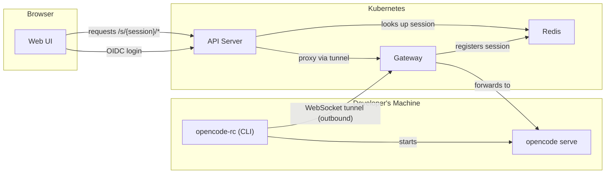

# OpenCode RC

Remote control for [OpenCode](https://github.com/anomalyco/opencode) in corporate environments.

OpenCode RC lets developers run OpenCode on their machines while accessing it from a browser through a centralized API server with OIDC authentication. A reverse WebSocket tunnel means dev machines don't need inbound network access — they connect outward to the gateway.

## Architecture


```mermaid
flowchart LR
    subgraph Dev["Developer's Machine"]
        CLI["opencode-rc (CLI)"]
        OC["opencode serve"]
    end
    subgraph K8s["Kubernetes"]
        WEB["API Server"]
        GW["Gateway"]
        REDIS["Redis"]
    end
    subgraph Browser
        UI["Web UI"]
    end

    CLI -- starts --> OC
    CLI -- "WebSocket tunnel (outbound)" --> GW
    GW -- registers session --> REDIS
    WEB -- looks up session --> REDIS
    UI -- OIDC login --> WEB
    UI -- "requests /s/{session}/*" --> WEB
    WEB -- "proxy via tunnel" --> GW
    GW -- "forwards to" --> OC
```

1. Developer runs `opencode-rc` CLI — it authenticates via OIDC, starts `opencode serve`, and opens a WebSocket tunnel to the gateway
2. The gateway registers the session in Redis and multiplexes browser traffic through the tunnel
3. The API server authenticates browser users via OIDC, looks up sessions in Redis, and proxies requests through the gateway
4. The web UI provides a session picker and wraps the OpenCode web interface

## Components

| Component | Path | Description |
|-----------|------|-------------|
| API Server | `api/` (TypeScript) | OIDC auth, session lookup, reverse proxy to gateway (serves no UI) |
| Gateway | `gateway/` (Go) | WebSocket tunnel server, session registration, request multiplexing |
| CLI | `cli/` (Node) | OIDC login via PKCE, starts opencode serve, maintains tunnel to gateway |
| Web UI | `ui/` (SolidJS) | Session picker, user bar, wraps OpenCode's web interface |
| UI Image | `ui/web/` (nginx) | Serves the built SPA on its own host, configured with the API URL at container start |

## Deploy with Helm

### Prerequisites

- Kubernetes cluster
- An OIDC provider (Keycloak, Dex, Azure AD, etc.)
- Two OIDC clients configured:
  - **API client** (confidential): for browser login via the API server. Redirect URI: `https://<api-host>/auth/callback`
  - **CLI client** (public): for developer CLI login via PKCE. Redirect URI: `http://127.0.0.1/callback` without a port; per RFC 8252 the IdP must accept any loopback port (the CLI listens on 43212–43215). For an IdP that matches ports exactly, register `http://127.0.0.1:43212/callback` through `:43215`

### Install

```bash
helm install opencode-rc ./charts/opencode-rc \
  --set oidcMock.enabled=false \
  --set oidc.issuer=https://sso.corp.example.com \
  --set existingSecret=opencode-rc-secrets \
  --set expose.type=ingress \
  --set expose.host=example.com \
  --set expose.ingress.className=nginx \
  --set expose.ingress.tlsSecretName=wildcard-example-com-tls
```

`expose.*` exposes the API, the gateway and the UI on hosts derived from a prefix and `expose.host`. The prefix is `expose.hostPrefix`, else `fullnameOverride`, else the Helm release name:

| Host | Routes |
|------|--------|
| `{prefix}.{host}` (e.g. `opencode-rc.example.com`) | `/tunnel` → gateway (CLI tunnel), everything else → API |
| `{prefix}-ui.{host}` (e.g. `opencode-rc-ui.example.com`) | web UI (when `ui.enabled`) |
| `{prefix}-oidc.{host}` (e.g. `opencode-rc-oidc.example.com`) | bundled oidc-mock (when `oidcMock.enabled`) |

The UI and the API are served from two different hosts. The browser loads the UI from the UI host and calls the API host directly. Public URLs are `{expose.scheme}://<host>` (`https` by default — TLS usually terminates at the ingress controller, load balancer or Istio gateway); set `api.publicUrl` / `ui.publicUrl` to override them. The OIDC redirect URI defaults to `<api public URL>/auth/callback`, e.g. `https://opencode-rc.example.com/auth/callback`. The CLI gateway URL is the API host, e.g. `https://opencode-rc.example.com`. Only `/tunnel` of the gateway is exposed; its `/healthz` is not reachable from outside the cluster.

The Ingress sets `nginx.ingress.kubernetes.io/proxy-read-timeout` and `proxy-send-timeout` to `"3600"` by default so ingress-nginx does not cut idle CLI tunnels, SSE streams and terminal WebSockets; values in `expose.ingress.annotations` override them. With other ingress controllers, configure the equivalent long timeouts through `expose.ingress.annotations`.

With Istio, point `expose.virtualService.gateways` at existing Istio Gateways that accept the hosts above (e.g. a `*.example.com` server). The chart creates VirtualServices (`networking.istio.io/v1` by default, which needs Istio 1.22+; set `expose.virtualService.apiVersion: networking.istio.io/v1beta1` for older Istio) and routes `/tunnel` to the gateway; Istio route timeouts are disabled by default, so long-lived tunnels and streams need no override:

```bash
helm install opencode-rc ./charts/opencode-rc \
  --set oidcMock.enabled=false \
  --set oidc.issuer=https://sso.corp.example.com \
  --set existingSecret=opencode-rc-secrets \
  --set expose.type=virtualService \
  --set expose.host=example.com \
  --set 'expose.virtualService.gateways={istio-system/public-gateway}'
```

The `existingSecret` must contain:

| Key | Description |
|-----|-------------|
| `cookie-secret` | 64-char hex string (32 bytes), HMAC key for access tokens |
| `oidc-client-secret` | OIDC client secret for the web client |
| `redis-url` | Redis connection URL (only if `redis.enabled=false`) |

### Key Values

| Value | Default | Description |
|-------|---------|-------------|
| `oidcMock.enabled` | `true` | Deploy the bundled OIDC mock; empty `oidc.*` values default to it |
| `oidcMock.clients` | web `opencode-rc`, cli `opencode-rc-cli` | Mock clients (`id`, `secret`, `redirectUris`); web redirect defaults to `<api public URL>/auth/callback` |
| `oidcMock.users` | alice, bob | Mock users |
| `oidc.issuer` | `""` | OIDC provider URL; required unless `oidcMock.enabled` |
| `oidc.clientId` | `""` | Web client ID (confidential); empty: the mock's web client, else `opencode-rc` |
| `oidc.cliClientId` | `""` | CLI client ID (public, PKCE); empty: the mock's CLI client, else `opencode-rc-cli` |
| `oidc.userClaim` | `sub` | ID token claim that identifies a user; web and CLI logins must get the same value (use `oid` for Entra ID) |
| `oidc.redirectUri` | auto-derived | OAuth callback URL; defaults to `<api public URL>/auth/callback` |
| `auth.accessTokenTTL` | `15m` | Access token lifetime |
| `auth.sessionTTL` | `7d` | Absolute login lifetime; refresh never extends it |
| `auth.allowedOrigins` | `[]` | Extra browser origins allowed for return_to and CORS |
| `auth.appLoginPrompt` | `select_account` | OIDC `prompt` sent to the IdP for mobile app logins (`select_account`, `login`, `consent`, or `""`); check that your IdP honors it |
| `authz.webhook.url` | `""` | Access webhook (see [Access Control](#access-control)); empty: every signed-in user may use their sessions |
| `authz.webhook.tokenSecret` | name `""`, key `token` | Secret key sent to the webhook as `Authorization: Bearer <token>` |
| `authz.timeout` | `5s` | Webhook timeout; a timeout denies |
| `authz.cacheTTL.allowed` / `.denied` | `60s` / `10s` | How long a decision is reused |
| `admin.tokenSecret` | name `""`, key `token` | Secret key holding the admin API bearer token; no admin API when the name is empty |
| `redis.enabled` | `true` | Deploy Redis; set `false` to use external Redis via secret |
| `tlsInsecureSkipVerify` | `false` | Skip TLS certificate verification for OIDC discovery |
| `expose.type` | `none` | `none`, `ingress` (one Ingress) or `virtualService` (Istio VirtualServices) |
| `expose.host` | `""` | Base domain; hosts are `{prefix}.{host}`, `{prefix}-ui.{host}` and, with `oidcMock.enabled`, `{prefix}-oidc.{host}`. Required unless `expose.type=none` |
| `expose.hostPrefix` | `""` | Host prefix; empty: `fullnameOverride`, else the release name |
| `expose.scheme` | `https` | Scheme browsers and the CLI use to reach the hosts |
| `expose.ingress.className` | `""` | `ingressClassName` of the Ingress |
| `expose.ingress.annotations` | `{}` | Ingress annotations, merged over the default ingress-nginx `proxy-read-timeout`/`proxy-send-timeout` of `"3600"` |
| `expose.ingress.tlsSecretName` | `""` | TLS secret covering all hosts (e.g. a wildcard certificate); no `tls` section when empty |
| `expose.virtualService.gateways` | `[]` | Existing Istio Gateways (`namespace/name`); required for `virtualService` |
| `expose.virtualService.apiVersion` | `networking.istio.io/v1` | VirtualService API version; `networking.istio.io/v1beta1` for Istio older than 1.22 |
| `expose.virtualService.annotations` | `{}` | VirtualService annotations |
| `api.cookieSecure` | `null` | Secure flag of the login cookies; null: true iff the API public URL is https |
| `api.publicUrl` | `""` | Browser-facing API URL; overrides the URL derived from `expose.*`. Required when `ui.publicUrl` is set with `expose.type=none` |
| `ui.enabled` | `true` | Deploy the UI image (nginx serving the built SPA) |
| `ui.publicUrl` | `""` | Browser-facing UI URL; overrides the URL derived from `expose.*`. Added to the API's allowed origins |
| `global.imageRegistry` | `""` | Override image registry for all components (e.g. `registry.corp.example.com`) |

See [`charts/opencode-rc/values.yaml`](charts/opencode-rc/values.yaml) for all options.

### Bundled OIDC Mock

By default the chart deploys an OIDC mock with test users (alice/bob) and a built-in Redis, so it runs without external dependencies:

```bash
helm install opencode-rc ./charts/opencode-rc
```

The mock is configured by `oidcMock.*` only. Empty `oidc.*` values default to it: the issuer, the client ids and the web client secret. With `expose.type` set, it is exposed on `{prefix}-oidc.{host}` with that host as its issuer; set `oidcMock.issuer` when browsers reach it at another URL. The API and the gateway always talk to it in-cluster.

For a real IdP, set `oidcMock.enabled=false`, `oidc.issuer` and `existingSecret`. Without `existingSecret` the chart renders a Secret from `secrets.*`, whose defaults are for development only.

### Access Control

Everyone who signs in can connect their machine with the CLI. Whether they may list and open sessions in the UI can be decided by a webhook you run. With `authz.webhook.url` set, the API sends:

```http
POST <authz.webhook.url>
Content-Type: application/json
Authorization: Bearer <token>   (only with authz.webhook.tokenSecret)

{"user": {"uid": "<oidc.userClaim value>", "email": "alice@example.com", "name": "Alice"}}
```

and expects `200` with `{"allowed": true}` or `{"allowed": false, "reason": "..."}` (the reason is logged). Any other response, an error or a timeout denies, and is not cached. A denied user sees a "No access" screen; the session list and proxy return `403`.

Decisions are cached in Redis per user for `authz.cacheTTL.allowed` / `.denied`. To apply a change sooner, set `admin.tokenSecret` and call the admin API on the API host:

```bash
curl -X DELETE -H "Authorization: Bearer $ADMIN_TOKEN" https://<api host>/admin/authz/cache/<uid>   # one user
curl -X DELETE -H "Authorization: Bearer $ADMIN_TOKEN" https://<api host>/admin/authz/cache         # everyone
```

The check runs when a request or stream starts: an already open event stream or terminal keeps running after access is revoked, until it closes.

### Air-Gapped Environments

Override the image registry to pull from an internal registry:

```bash
helm install opencode-rc ./charts/opencode-rc \
  --set global.imageRegistry=registry.corp.example.com/opencode-rc
```

Images to mirror:

| Image | Tag |
|-------|-----|
| `ghcr.io/rophy/opencode-rc/api` | `0.6.0` |
| `ghcr.io/rophy/opencode-rc/ui` | `0.5.0` |
| `ghcr.io/rophy/opencode-rc/gateway` | `0.6.0` |
| `ghcr.io/rophy/oidc-mock` | `20260913-34fdbaf` |
| `redis` | `7.4.11-alpine` |

## CLI Usage

Install:

```bash
npm install -g opencode-rc
```

Configure `~/.config/opencode/rc.json`:

```json
{
  "gatewayUrl": "https://opencode-rc.example.com"
}
```

The CLI fetches the OIDC issuer and CLI client ID (`oidc.cliClientId`) from the server; `oidc.issuer` and `oidc.clientId` in this file override them.

Run:

```bash
opencode-rc
```

The CLI authenticates via OIDC (opens browser), starts `opencode serve`, and maintains a tunnel to the gateway. Press `Ctrl+C` to disconnect.

Environment variables override the config file — see the [CLI README](cli/README.md) for details.

### CLI Environment Variables

| Variable | Description |
|----------|-------------|
| `OPENCODE_RC_GATEWAY_URL` | Gateway URL |
| `OIDC_ISSUER` | OIDC provider URL (default: from the server) |
| `OIDC_CLIENT_ID` | CLI client ID (default: from the server) |
| `TLS_INSECURE_SKIP_VERIFY` | Set to `true` to skip TLS certificate verification |
